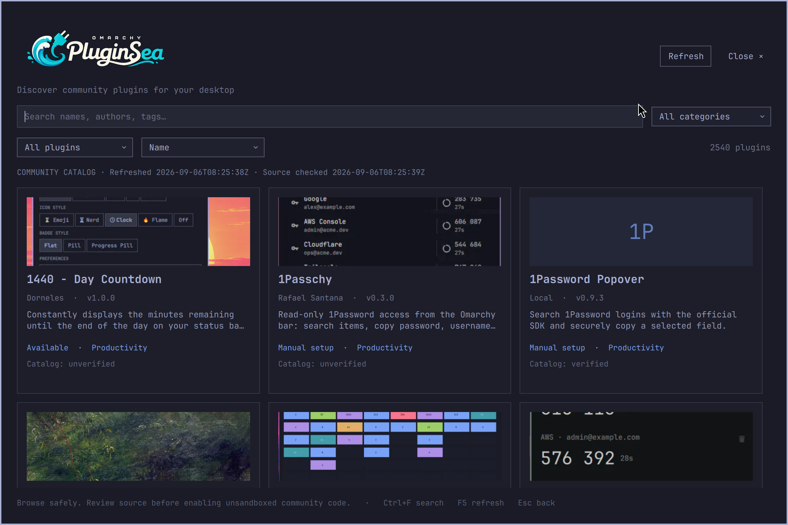

# Omarchy Plugin Sea


A native, theme-aware community plugin browser inside the existing Omarchy Quickshell desktop. Browse cards and previews, search names/authors/tags, filter by category or installation state, sort by name/stars/listing date, inspect provenance, and manage local plugins with explicit consent.



## Open

```bash
oma-plug-sea
# Or: Setup → Plugins → Browse
# Stable IPC route:
omarchy-shell shell summon local.oma-plug-sea '{}'
```

The repository directory is `omarchy_plugin_sea` and the visible application name is **Omarchy Plugin Sea**. The existing `oma-plug-sea` command, `local.oma-plug-sea` manifest ID, and cache/state paths are retained for compatibility.

## Requirements and setup

Omarchy with the current plugin CLI, a running Quickshell shell, Bash, curl, jq, Git, util-linux (`flock`, `prlimit`), coreutils (`timeout`), Perl, and Qt6 with `qt6-imageformats` for WebP previews. A small native Qt helper decodes previews in a separate process and caches PNGs. No Python, Node, database, or web framework is required. Building from source needs `g++`, `pkg-config` and Qt6 development files (`gcc`, `pkgconf`, `qt6-base` on Arch). Setup and checks also require `qt6-declarative` (`qmllint` and the Qt6 QML runner), `libwebp` fixture APIs and `ripgrep`. The optional desktop keyboard smoke check requires `wtype`.

Install missing native dependencies from a terminal:

```bash
omarchy pkg add qt6-imageformats gcc pkgconf qt6-base qt6-declarative libwebp ripgrep
```

Use mise for the project environment and commands:

```bash
cd /path/to/omarchy_plugin_sea
mise trust
mise run setup
mise run check
mise run install
mise run open
```

`mise.toml` intentionally uses the system's matching Qt/Omarchy runtime instead of downloading a conflicting language stack. Setup builds the native preview helper and checks decoder support and native dependencies. The development installer copies the runtime files into `~/.config/omarchy/plugins/local.oma-plug-sea`, creates `~/.local/bin/oma-plug-sea`, and adds one marked `setup.plugin.browse` property to the supported menu extension. It preserves other entries and comments, refuses unowned targets and symlinks, and backs up existing files under `${XDG_STATE_HOME:-~/.local/state}/oma_plug_sea/` before changes. No files under `/usr/share/omarchy` are edited.

Re-run `mise run install` after source changes. Omarchy validates against symlinks, so this uses a copy rather than a development symlink. If Quickshell retains a stale imported component after editing QML, run `omarchy restart shell` once and reopen. The installed host currently hardcodes `~/.config/omarchy`; cache and state storage honor XDG variables.

## Interaction

- Type to search; search is debounced and includes descriptions, IDs, tags and categories.
- Use category/state/sort selectors; refresh preserves search and filter context. While open, the browser checks the catalog source every five minutes and highlights **Refresh available** when it detects a change. Checks do not replace the catalog until you refresh.
- Down from search moves to cards; arrows navigate, Enter/Space open details. Click a card for the same view.
- Tab moves between controls. Ctrl+F returns to search; F5 refreshes. Escape cancels consent, returns from details, clears search, then closes.
- Details show source, preview or fallback, local version/state, upstream checks and exact review/observed commits when supplied.
- Click a detail preview (or focus it and press Enter/Space) to open the original-resolution viewer. Use Fit, 100%, zoom controls and scrolling/dragging to inspect it; Escape returns to the same detail page. Original images keep the existing download and decoder safety limits, with a separate cache from card previews.
- The Available filter shows only listings supported by the in-app installer; manual-only entries remain in All plugins.
- Catalog warnings such as quarantined or withdrawn remain visible even when a plugin is installed, including in action consent. Disable and remove remain available for recovery.
- Install defaults to disabled. Install & enable is a separate explicit choice. Enable, disable, update and removal appear according to local state.
- Operations show progress, capture stdout/stderr in Diagnostics, prevent conflicting actions, and confirm local state before reporting success.

## Catalog and trust

Verified on **2026-09-05**: `https://omarchyplugins.com/` redirects to `https://plugins.omarchy.org/`; the working deployed source is [`/catalog.json`](https://plugins.omarchy.org/catalog.json), containing 2,427 listings during verification. The marketplace's own source is [omacom/omarchy-plugin-marketplace](https://github.com/omacom/omarchy-plugin-marketplace). This is browse metadata, **not a signed installation registry**. See [platform research](docs/platform-research.md) for exact source contracts and official registry deployment probes.

Community plugins run **unsandboxed as your user**. Browsing and opening details never import their QML or execute their scripts. The browser never executes a catalog `installCommand`. It accepts canonical HTTPS GitHub repository sources for installation and delegates Git operations and manifest validation to `omarchy plugin add/enable/disable/update/remove`.

Consent snapshots the exact ID/source and clearly labels catalog verification and reviewed commits. For installed plugins, View installed source opens the installed origin; a separate Catalog source link identifies a differing listing repository. Missing or differing origins never inherit catalog verification. Even matching origins do not verify the installed revision. A listing marked “verified” describes the marketplace's snapshot checks, not a security audit. The installed Git CLI clones or updates **mutable HEAD**, which may differ from the listed reviewed commit. Updates of enabled code can execute it immediately; consent explicitly acknowledges skipping the CLI's interactive diff prompt.

Installation checks Git’s effective clone URL before calling Omarchy, so an existing Git URL rewrite cannot silently select another repository. After installation, the app checks the disabled checkout’s manifest and both its recorded and effective Git origins before reporting success or enabling it.

Updates carry the approved installed origin to the helper, which rejects changed, rewritten or ambiguous origins before invoking the CLI. Omarchy does not expose an atomic expected-origin update option: unrelated external Git configuration changes can still race the final check and fetch.

Install & enable first installs disabled, verifies the expected ID and then enables. A source changing its ID fails confirmation and can leave a disabled checkout to inspect. Installation is refused when undiscovered third-party IDs remain referenced in shell.json, since those dormant references could cause a supposedly disabled installation to load code. No configuration is silently removed to bypass that guard. Existing configuration is backed up before mutations. Bar widgets use their manifest's default placement through the supported enable command.

The official signed registry API/client was not deployed at verification time. When a real signed client ships, the catalog adapter can migrate independently, while all signature, checksum, freshness, compatibility, receipt and revocation enforcement must remain owned by that client. Current code does not fabricate those guarantees.

## Offline behavior

The last good normalized catalog lives at `${XDG_CACHE_HOME:-~/.cache}/oma_plug_sea/catalog.json`. Refresh uses 5-second connection and 25-second total timeouts and atomically replaces only a validated document. Malformed optional status values disable only the affected listing. Failed requests, malformed required entries and duplicate IDs preserve the good cache and return it with a visible stale indicator and refresh timestamp. Without any cache, the UI shows an honest empty/error state, retains local plugins, and offers Refresh. No fixture catalog is passed off as live data.

Previews are accepted only from the marketplace’s supported WebP asset URLs. Every accepted image goes through the restricted downloader and separate decoder; the desktop shell receives a cached PNG, never a remote image URL. Other formats, origins and failed previews display a fallback. Conversion is bounded and cached independently. Lifecycle commands have a 120-second timeout and a per-user action lock. A stopped shell, missing command, changed plugin state or unsuccessful postcondition produces a failure with diagnostics.

## Development and verification

```bash
mise run check
# Actual desktop smoke: summon/hide and controlled inert local panel lifecycle
mise run smoke
scripts/keyboard-smoke
# Explicit individual checks
omarchy plugin validate .
for f in bin/* scripts/*; do bash -n "$f"; done
bash tests/backend.sh
bash tests/model.sh
scripts/test-integration
git diff --check
```

Desktop tests first compare the checkout, installed files and a fingerprint reported by the running app. A mismatch fails the test and asks you to reinstall; a stale shell instance must be reopened or restarted. Each installed build uses its own runtime path so QML imports cannot be reused from another build.

The smoke test briefly creates an inert locally authored `local.oma-plug-sea-smoke` panel, enables, disables and removes it through the real helper/CLI, and verifies each postcondition. It never installs arbitrary third-party code. Integration tests use isolated HOME and mocked CLI state; backend tests exercise malformed/partial data, invalid URLs/IDs, stale cache, network and subprocess failures, concurrency, consent, source mismatches and false-success rejection. Model tests execute the actual JavaScript through Qt6.

[Architecture and helper schema](docs/architecture.md) · [Verification evidence](docs/verification.md) · [Contributor instructions](AGENTS.md)

## Troubleshooting

```bash
omarchy-shell shell ping
omarchy plugin list --json
omarchy-shell shell rescanPlugins
bin/oma-plug-sea-catalog refresh | jq '{ok,stale,error,count:(.plugins|length)}'
omarchy-shell shell call local.oma-plug-sea status '{}'
quickshell log -p "$OMARCHY_PATH/shell" -t 100 --no-color
```

If the shell is stopped, use `omarchy restart shell`. If `oma-plug-sea` is not on your PATH, use `~/.local/bin/oma-plug-sea` or the IPC route. A source/ID mismatch requires inspecting local plugin directories before retrying. A dormant-reference error requires reviewing stale shell.json references; restore from a backup if needed. An action lock error means another browser operation is running. Terminal-driven operations do not share this lock, so concurrent external changes can fail a postcondition and require refresh.

## Removal and recovery

```bash
mise run uninstall
```

With the shell running, this hides/disables the browser, moves its managed copy into the recoverable state directory, removes only its marked menu block and launcher, rescans, and verifies it is undiscovered. Other extensions/configuration remain. Backups and caches are intentionally retained; delete `${XDG_CACHE_HOME:-~/.cache}/oma_plug_sea` and `${XDG_STATE_HOME:-~/.local/state}/oma_plug_sea` manually once you no longer need recovery. The source checkout is independent and can be removed separately. Reinstall with `mise run install`.

## Known limits

These limits mostly concern installing and updating plugins. You can still browse the catalog, inspect details and previews, and search cached listings offline.

### Some plugins need manual installation

The app can install plugins whose GitHub repositories follow the structure supported by Omarchy's installer. Some listings contain several plugins in one repository, need custom setup, or replace a larger part of the desktop. You can browse those listings and open their source, but you must follow the author's installation instructions yourself. The **Available** filter shows only listings supported by the in-app installer.

### Catalog checks do not guarantee the code you install

When you install or update a plugin, Omarchy fetches the repository's current code. Its author may have changed that code since the catalog checked it. A **verified** catalog label therefore does not mean the plugin is safe, or that your installed version was checked.

The current installer does not use signed releases that would let it authenticate the exact version described by the catalog. Community plugins run with your user account's permissions when enabled, so only enable code you trust. **Install disabled** lets you inspect the downloaded code before enabling it; it does not make that code safe automatically.

### A catalog refresh is different from a plugin update

**Refresh available** means the catalog has changed—for example, a new plugin was listed or a description was updated. It does not necessarily mean any of your installed plugins have updates.

The app cannot reliably show an update-available badge for each installed plugin in advance. **Check & update** checks the installed plugin's repository and applies an update if one is available; it is not a check-only action. Updating an enabled plugin may run its new code immediately, so the app asks for consent first.

### Remove Plugin Sea from the terminal

Plugin Sea cannot disable or uninstall itself through its own interface. Doing so could interrupt an operation before it finishes or reports its result.

To remove it, run `mise run uninstall` from this project's directory while the Omarchy shell is running. This removes its managed installation, launcher and menu entry while retaining recovery backups. See [Removal and recovery](#removal-and-recovery) for details.

### Missing information does not mean missing permissions

Some catalog entries omit compatibility results, capabilities or other details. The app reports those fields as unknown. For example, missing information about file access does **not** mean a plugin cannot read your files: enabled community plugins run with your account's permissions.

### Avoid changing the same plugin in two places at once

The app prevents its own management operations from overlapping, but it cannot stop a terminal command or another program from changing the same plugin.

For example, a plugin's Git origin could change while its update consent dialog is open. The app checks the origin again and refuses the update if it detects a change. However, Omarchy's update command cannot make that check and the subsequent fetch one indivisible operation, so an external change in between can still slip through. Installation has similar source checks before cloning and before enabling, with the same limitation around simultaneous external changes. Avoid managing the same plugin simultaneously through the app and a terminal.

Setting up Plugin Sea does not publish your project, push code to GitHub, submit a marketplace listing, or install community plugins. Those are separate actions you choose.

MIT licensed.
