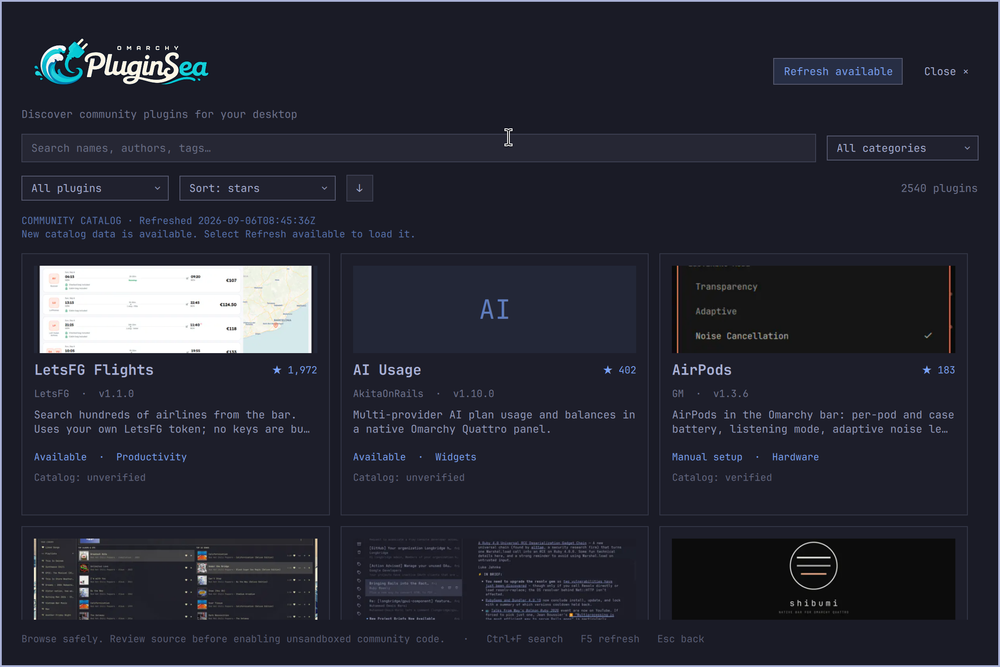

# Omarchy Plugin Sea


A native, theme-aware community plugin browser inside the existing Omarchy Quickshell desktop. Browse cards and previews, search names/authors/tags, filter by category or installation state, sort by name/stars/hearts/listing date, inspect provenance, and manage local plugins with explicit consent.



## Install

Requires Omarchy with the Quickshell plugin CLI and a running shell. Standard Omarchy tools (Bash, curl, jq, Git, util-linux and coreutils) are used at runtime. Install the native preview dependencies if they are missing, then use Omarchy's standard installer:

```bash
omarchy pkg add qt6-imageformats gcc pkgconf qt6-base
omarchy plugin add https://github.com/webTechSponge/omarchy_plugin_sea --enable
```

On first preview use, the app automatically compiles its bundled Qt decoder into your private cache. It reuses that build and rebuilds when the decoder source or toolchain changes. There is no separate build/setup command, downloaded executable or administrative action inside the app. The first preview may take a few seconds; missing packages or build failures are explained on the detail page. Dependencies must already be installed: Omarchy does not install them from plugin manifests.

## Open

```bash
omarchy-shell shell summon webtechsponge.plugin-sea '{}'
```

For a standard Git installation, this is the opening command. Omarchy does not automatically create menu entries or launchers for overlays. The separate development-install workflow below adds `oma-plug-sea` and **Setup → Plugins → Browse**.

To update a standard installation of Plugin Sea itself, close and disable it, then run `omarchy plugin update webtechsponge.plugin-sea`. That external command follows mutable upstream HEAD; inspect the resulting code and revision before enabling again. To remove it, run `omarchy plugin remove webtechsponge.plugin-sea`. The preview cache is retained and can be removed separately.

The repository directory is `omarchy_plugin_sea` and the visible application name is **Omarchy Plugin Sea**. The permanent manifest ID is `webtechsponge.plugin-sea`, authored by **webTechSponge** under the MIT license. The existing `oma-plug-sea` command and `oma_plug_sea` cache/state paths remain unchanged.

## Migration from the development ID

The permanent plugin ID is now `webtechsponge.plugin-sea`; earlier installations used `local.oma-plug-sea`. Remove the old installation before installing the new ID. An in-place Git update is not an ID migration.

For a **managed development installation**, run `mise run uninstall` from the **old checkout before updating its source**. Its old scripts remove the old ID, launcher and marked menu entry with recoverable backups. Then update the checkout and run `mise run install` to install the new ID. Do not run the new uninstall script to remove an old-ID installation.

For a **standard Git installation**, first back up any edits in `~/.config/omarchy/plugins/local.oma-plug-sea`; the removal command deletes that Git checkout. Then close and remove the old plugin and install the new one:

```bash
omarchy-shell shell hide local.oma-plug-sea
omarchy plugin remove local.oma-plug-sea
omarchy plugin add https://github.com/webTechSponge/omarchy_plugin_sea --enable
omarchy-shell shell summon webtechsponge.plugin-sea '{}'
```

Existing catalog, preview and decoder caches remain usable because their storage identifiers have not changed. If you have already updated the old checkout, recover its previous scripts before uninstalling, or review and remove the old integration separately; the new installer does not silently migrate user configuration.

## Development setup

The app uses a separate native Qt helper for preview decoding; no Python, Node, database, or web framework is required at runtime. In addition to the standard installation dependencies above, development integration needs Perl. Setup and checks require `qt6-declarative` (`qmllint` and the Qt6 QML runner), `libwebp` fixture APIs and `ripgrep`. The optional desktop keyboard smoke check requires `wtype`.

Install missing native dependencies from a terminal:

```bash
omarchy pkg add qt6-imageformats gcc pkgconf qt6-base qt6-declarative libwebp ripgrep
```

Use this workflow instead of the standard Git installation when developing the app. It creates a managed runtime copy and refuses to overwrite a standard Git installation. Use mise for the project environment and commands:

```bash
cd /path/to/omarchy_plugin_sea
mise trust
mise run setup
mise run check
mise run install
mise run open
```

`mise.toml` intentionally uses the system's matching Qt/Omarchy runtime instead of downloading a conflicting language stack. Setup builds the native preview helper and checks decoder support and native dependencies. The development installer copies the runtime files into `~/.config/omarchy/plugins/webtechsponge.plugin-sea`, creates `~/.local/bin/oma-plug-sea`, and adds one marked `setup.plugin.browse` property to the supported menu extension. It preserves other entries and comments, refuses unowned targets and symlinks, and backs up existing files under `${XDG_STATE_HOME:-~/.local/state}/oma_plug_sea/` before changes. No files under `/usr/share/omarchy` are edited.

Re-run `mise run install` after source changes. Omarchy validates against symlinks, so this uses a copy rather than a development symlink. If Quickshell retains a stale imported component after editing QML, run `omarchy restart shell` once and reopen. The installed host currently hardcodes `~/.config/omarchy`; cache and state storage honor XDG variables.

## Interaction

- Type to search; search is debounced and includes descriptions, IDs, tags and categories.
- Use category/state/sort selectors; refresh preserves search and filter context. While open, the browser checks the catalog source every five minutes and highlights **Refresh available** when it detects a change. Checks do not replace the catalog until you refresh.
- Cards show repository star counts; choose **Sort: name**, **Sort: stars**, **Sort: hearts** or **Sort: date**, then use the separate **↑ / ↓** button for ascending or descending order. For the most-starred repositories first, choose stars and **↓**. Direction stays unchanged when switching sort fields. Hover a count for its meaning, or the availability and catalog labels for plain-language explanations.
- Hearts are anonymous aggregate interactions reported by the omarchyplugins.com marketplace engagement API — not downloads, installs, unique people, or safety signals. "—" means the marketplace has no record for that plugin. Heart data refreshes alongside the catalog and is cached locally; if the engagement API is unreachable, the last saved counts stay visible and the catalog is unaffected. A **❤️ Send a heart** button on catalog-listed details sends one anonymous heart after explicit consent (reported as an anonymous heart from the plugins.omarchy.org origin; rate-limited; one per plugin per computer); it never affects installs or verification.
- Down from search moves to cards; arrows navigate, Enter/Space open details. Click a card for the same view.
- Tab moves between controls. Ctrl+F returns to search; F5 refreshes. Escape cancels consent, returns from details, clears search, then closes.
- Details show source, preview or fallback, local version/state, upstream checks and exact review/observed commits when supplied.
- Click a detail preview (or focus it and press Enter/Space) to open the original-resolution viewer. Use Fit, 100%, zoom controls and scrolling/dragging to inspect it; Escape returns to the same detail page. Original images keep the existing download and decoder safety limits, with a separate cache from card previews.
- The Available filter shows only listings supported by the in-app installer; manual-only entries remain in All plugins.
- Catalog warnings such as quarantined or withdrawn remain visible even when a plugin is installed, including in action consent. Disable and remove remain available for recovery.
- Install defaults to disabled at the exact verified listing commit. Install & enable is a separate explicit choice. Community Enable requires a matching, detached, clean snapshot; disable and removal remain recovery actions. Updates are managed externally, not through an in-app update button.
- Operations show progress, capture stdout/stderr in Diagnostics, prevent conflicting actions, and confirm local state before reporting success.

## Catalog and trust

Verified on **2026-09-05**: `https://omarchyplugins.com/` redirects to `https://plugins.omarchy.org/`; the working deployed source is [`/catalog.json`](https://plugins.omarchy.org/catalog.json), containing 2,427 listings during verification. The marketplace's own source is [omacom/omarchy-plugin-marketplace](https://github.com/omacom/omarchy-plugin-marketplace). This is browse metadata, **not a signed installation registry**. See [platform research](docs/platform-research.md) for exact source contracts and official registry deployment probes.

Community plugins run **unsandboxed as your user**. Browsing and opening details never import their QML or execute their scripts. The browser never executes a catalog `installCommand`. It fetches an exact reviewed Git object itself, uses `omarchy plugin validate` for static validation, and delegates enable/disable/removal to Omarchy. The standard commands above install Plugin Sea itself through the platform's mutable Git installer; they are separate from this app's pinned community-install path.

In-app installation requires an available root-plugin listing with `manifestPath: "manifest.json"`, a full lowercase 40-character `listingValidatedCommit`, `verificationSnapshotStatus: "verified"`, and the same `verificationCommit`. Consent snapshots the exact ID, canonical HTTPS GitHub repository and SHA. A newer unverified upstream commit does not replace the older verified snapshot. Missing, mismatched, blocked or stale evidence prevents installation; a fresh catalog is required again before publication and community enable.

The helper fetches only that commit into private hidden staging, checks out detached, verifies literal file contents, origin and manifest ID, and validates the root with Omarchy before an atomic no-overwrite/no-copy publication. It never installs HEAD and resets afterward. Git operations isolate inherited configuration, hooks, filters, URL rewrites and replacement objects. Submodules and unsafe local Git configuration are unsupported.

Install & enable confirms disabled discovery first, then rechecks the snapshot before enabling. Standalone community Enable applies the same revision/content checks, including case-colliding untracked files regardless of Git case-folding configuration, ignored files, ownership and writable-file refusal. Both paths reject duplicate discovered manifest IDs before deduplication and require the shell's actual selected source to match the verified canonical checkout. The updated browser must be loaded for this non-executing registry inspection; unavailable or stale selection fails closed. Modified, attached, unknown-origin or local-only community installations must be managed explicitly outside the app; user edits are never reset to make them eligible. First-party enable remains platform-managed. Installed-source links still identify the actual origin when source selection is unambiguous; a content match is not authentication, a security audit or a safety guarantee.

Installation is refused when undiscovered third-party IDs remain referenced in shell.json, since dormant references could activate newly discovered code. No configuration is silently removed to bypass that guard. Existing configuration is backed up before mutations, unrelated development symlinks remain untouched, and bar widgets use their manifest's default placement through the supported enable command. A failure after publication retains the installation and reports its actual or unconfirmed state for inspection.

The official signed registry API/client was not deployed at verification time. When a real signed client ships, the catalog adapter can migrate independently, while all signature, checksum, freshness, compatibility, receipt and revocation enforcement must remain owned by that client. Current code does not fabricate those guarantees.

## Offline behavior

The last good normalized catalog lives at `${XDG_CACHE_HOME:-~/.cache}/oma_plug_sea/catalog.json`. Refresh uses 5-second connection and 25-second total timeouts and atomically replaces only a validated document. Malformed optional status values disable only the affected listing. Failed requests, malformed required entries and duplicate IDs preserve the good cache and return it with a visible stale indicator and refresh timestamp. Without any cache, the UI shows an honest empty/error state, retains local plugins, and offers Refresh. No fixture catalog is passed off as live data.

Cached browsing remains available offline, but installation and community enable require a successful fresh catalog fetch. A stale cache cannot authorize new code installation or enable. Action-time validation does not replace the saved browsing catalog or its change-detection baseline: refused and successful actions cannot erase notifications for unseen catalog changes. Explicit refresh loads the new model and updates that baseline; pending consent retains its original ID/source/SHA and must be reviewed again if those change.

Previews are accepted only from the marketplace’s supported WebP asset URLs. Every accepted image goes through the restricted downloader and separate decoder; the desktop shell receives a cached PNG, never a remote image URL. Other formats, origins and failed previews display a fallback. Conversion is bounded and cached independently. Lifecycle commands have a 120-second timeout and a per-user action lock. A stopped shell, missing command, changed plugin state or unsuccessful postcondition produces a failure with diagnostics.

## Development and verification

```bash
mise run check
# Actual desktop smoke: summon/hide and controlled inert local panel lifecycle
mise run smoke
scripts/keyboard-smoke
# Explicit individual checks
omarchy plugin validate .
for f in bin/* scripts/*; do bash -n "$f"; done
bash tests/backend.sh
bash tests/model.sh
bash tests/standard-install.sh
bash tests/standard-cli-install.sh
bash tests/pinned-install.sh
scripts/test-integration
git diff --check
```

Desktop tests require the managed development installation; they are not intended to run against a standard Git installation. They first compare the checkout, installed files and a fingerprint reported by the running app. A mismatch fails the test and asks you to reinstall; a stale shell instance must be reopened or restarted. Each installed build uses its own runtime path so QML imports cannot be reused from another build.

Standard Git installations clone the full repository, not just the runtime files. Do not commit automatically loaded agent instruction files such as `AGENTS.md`, including in subdirectories: they would become ambient instructions for agents working in an installed plugin. Keep agent-specific contributor guidance outside this repository under a filename agents do not automatically load. The real Git installation regression checks the installed tree for common auto-loaded instruction filenames.

The smoke test briefly creates an inert locally authored `local.oma-plug-sea-smoke` panel, verifies that local-only in-app enable is refused, enables it explicitly through the external CLI, then disables/removes it through the helper. It never enables arbitrary third-party code. Development integration tests use isolated HOME and mocked CLI state. `tests/pinned-install.sh` and `tests/catalog-freshness.sh` use real Git, installed Omarchy validation/catalog commands, and Node to execute the installed registry's actual source selection and shell list renderer. They cover reviewed A versus upstream B, duplicate/stale selected sources, case-colliding extra files, tampering, consent freshness, notification baselines, collision guards and retained failure states. HTTP/Git transport, shell IPC/config persistence and activation are simulated; QML entrypoint bytes are recorded, not executed. Node is a test-harness prerequisite, not a runtime dependency. The standard-install regression separately exercises installing Plugin Sea itself through real Omarchy add/validate/catalog with an isolated local repository. Model tests execute the actual JavaScript through Qt6.

`tests/numeric-format.sh` compares native jq discovery identities with the installed registry's JavaScript coercion and a native Qt `JSON.parse`/`String` oracle, including exponent/fixed notation, binary64 rounding, zero, subnormal/overflow boundaries and nested singleton arrays. Only Qt-accepted manifest inputs are used. Pinned-install regressions keep unrelated numeric manifests present before string-ID installation and prove that distinct IDs retain reviewed provenance and enable successfully, while genuine numeric/string duplicates refuse installation and activation. Node remains test-only.

Numeric discovery regressions include the valid long subnormal literal `5.0000000000000000001e-324`. Consumer coverage proves reviewed installation/enable, dirty-content recovery and first-party operations remain available alongside it, and new observations detect added/removed duplicates rather than reusing stale authority. Performance is exercised with a bounded throwaway ordinary-row timing smoke, not a permanent microbenchmark or call-count test.

[Architecture and helper schema](docs/architecture.md) · [Verification evidence](docs/verification.md)

## Troubleshooting

```bash
omarchy-shell shell ping
omarchy plugin list --json
omarchy-shell shell rescanPlugins
# Run this helper command from the project checkout:
bin/oma-plug-sea-catalog refresh | jq '{ok,stale,error,count:(.plugins|length)}'
omarchy-shell shell call webtechsponge.plugin-sea status '{}'
quickshell log -p "$OMARCHY_PATH/shell" -t 100 --no-color
```

If the shell is stopped, use `omarchy restart shell`. A standard Git installation does not add `oma-plug-sea` to PATH; use the [Open](#open) IPC command. The `~/.local/bin/oma-plug-sea` launcher exists only after development integration. If summon reports that the plugin is disabled, run `omarchy plugin enable webtechsponge.plugin-sea` and try again. A source/ID mismatch requires inspecting local plugin directories before retrying. A dormant-reference error requires reviewing stale shell.json references; restore from a backup if needed. An action lock error means another browser operation is running. Terminal-driven operations do not share this lock, so concurrent external changes can fail a postcondition and require refresh.

### Preview setup problems

The first uncached preview may show **Preparing preview…** while the bundled decoder builds. If dependencies are missing, install the packages shown in the detail-page error, then reopen the detail page to retry. Compilation is limited to 60 seconds; a failed build is not published and the next request can try again.

For a standard Git installation, this optional diagnostic command prepares the decoder and prints its cached executable path:

```bash
~/.config/omarchy/plugins/webtechsponge.plugin-sea/bin/oma-plug-sea-build-preview
```

The decoder cache is `${XDG_CACHE_HOME:-~/.cache}/oma_plug_sea/decoder-builds/`; downloaded/converted images are in the sibling `previews/` directory. Builds are keyed by source and toolchain, so updates rebuild automatically when needed. Removing these caches is optional; subsequent previews recreate them. Already cached PNGs can be displayed without a compiler or a new download.

## Removal and recovery

For a **standard Git installation**, close the browser and use Omarchy's normal removal command:

```bash
omarchy plugin remove webtechsponge.plugin-sea
```

This removes the installed Git checkout through Omarchy. Reinstall with the [standard install commands](#install).

For a **managed development installation**, run this from the project checkout while the shell is running:

```bash
mise run uninstall
```

This hides/disables the browser, moves its managed copy into the recoverable state directory, removes only its marked menu block and launcher, rescans, and verifies it is undiscovered. Other extensions/configuration remain. The source checkout is independent. Reinstall this development integration with `mise run install`.

Both workflows retain app caches and existing recovery data. You can manually delete `${XDG_CACHE_HOME:-~/.cache}/oma_plug_sea` and `${XDG_STATE_HOME:-~/.local/state}/oma_plug_sea` once you no longer need cached browsing or backups. Development uninstall deliberately refuses to remove an ordinary Git installation; choose the command matching how you installed the app.

## Known limits

These limits mostly concern installing and updating plugins. You can still browse the catalog, inspect details and previews, and search cached listings offline.

### Some plugins need manual installation

The app installs only available root-plugin GitHub repositories with exact verified snapshot evidence. Listings containing several plugins, custom setup, shell suites, missing review evidence or unsupported Git layouts remain browseable but require external management. The **Available** filter shows only currently eligible snapshot installations.

### Catalog checks do not guarantee the code you install

In-app installation selects the exact verified listing commit, not the author's current upstream HEAD. The backend verifies detached HEAD and literal contents before publication and enable. A newer upstream version is not substituted automatically.

Catalog metadata is still unsigned: pinning binds installed Git content to its selected SHA, but does not authenticate a signed marketplace authority or make reviewed code safe. Community plugins run with your user account's permissions when enabled. **Install disabled** lets you inspect the downloaded code; it is not a sandbox.

### A catalog refresh is different from a plugin update

**Refresh available** means the catalog has changed—for example, a new plugin was listed or a description was updated. It does not necessarily mean any of your installed plugins have updates.

There is no in-app update operation. For a Git-managed plugin, disable it before an explicit external `omarchy plugin update ID`, because updating enabled code can live-reload and run it immediately. That command follows mutable upstream HEAD and is outside the app's snapshot guarantee. Inspect the resulting code/revision before enabling externally. For non-Git or managed development installations, follow their documented installation workflow instead. A changed checkout may no longer qualify for in-app enable.

### Remove Plugin Sea from the terminal

Plugin Sea cannot disable or uninstall itself through its own interface. Doing so could interrupt an operation before it finishes or reports its result.

For a standard Git installation, run `omarchy plugin remove webtechsponge.plugin-sea`. For the managed development installation, run `mise run uninstall` from this project's directory while the Omarchy shell is running. The development command also removes its launcher and menu entry while retaining recovery backups. See [Removal and recovery](#removal-and-recovery) for details.

### Missing information does not mean missing permissions

Some catalog entries omit compatibility results, capabilities or other details. The app reports those fields as unknown. For example, missing information about file access does **not** mean a plugin cannot read your files: enabled community plugins run with your account's permissions.

### Avoid changing the same plugin in two places at once

The app prevents its own management operations from overlapping, but it cannot stop a terminal command or another program from changing the same plugin.

The helper checks the selected catalog identity, Git object integrity and installed contents immediately before enabling. Its lock coordinates this app's actions, not arbitrary same-user processes. Another process can still alter files or configuration between a check and shell activation; these checks narrow that race rather than eliminate it. Avoid managing the same plugin simultaneously through the app and a terminal.

Setting up Plugin Sea does not publish your project, push code to GitHub, submit a marketplace listing, or install community plugins. Those are separate actions you choose.

MIT licensed.
