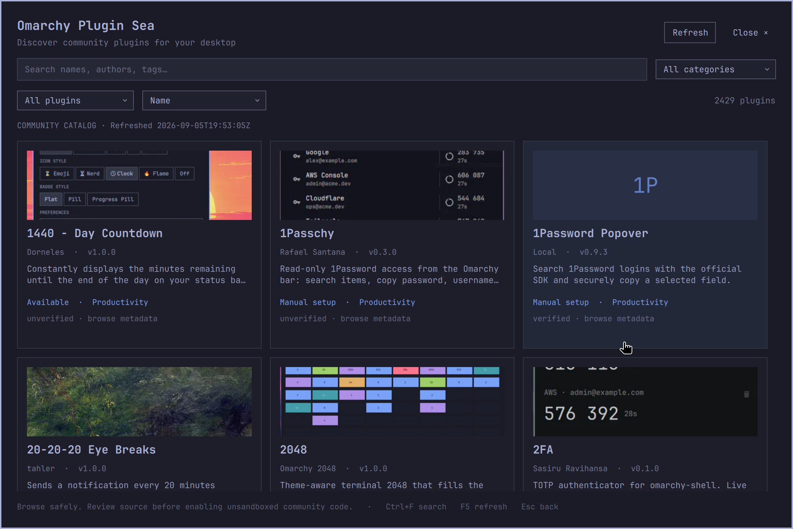

# Verification — 2026-09-05

Completed on the installed Omarchy desktop: one 2560×1600 display at scale 2 (1280×800 logical), Qt6 6.11.2, existing running Quickshell. No community plugin was installed to prove lifecycle behavior.

| Check | Result |
|---|---|
| `mise run setup` | Native dependencies and shell ping pass |
| `omarchy plugin validate .` | Pass |
| Bash syntax for every helper/script/test | Pass |
| `mise run check` | Pass: backend, actual Qt6 JS model, preview and isolated integration suites |
| Backend behavior/security | 43 assertions pass |
| Actual Qt6 CatalogModel tests | 13 assertions pass |
| Preview behavior/security | Decode, cached reuse, strict URL boundary, malformed data, resize, concurrent conversion pass |
| Isolated integration | Async registry discovery, repeated install/uninstall, byte-identical JSONC roundtrip, backups, unowned target and dangling-symlink rejection pass |
| Basic `qmllint` | Pass |
| Qt6 `qmllint` with host alias imports | Exit 0; 67 advisory warnings for Quickshell creatability/type metadata, dynamic theme objects and unqualified component access. Runtime was checked separately |
| `mise run smoke` | Actual summon/hide and inert local panel enable/disable/remove postconditions pass; fixture removed |
| `scripts/keyboard-smoke` | Search, arrows, Enter, details, Escape/back, empty search result and closing pass |
| Mouse input | Real Wayland pointer card activation, install-consent opening/cancellation, state/sort/category selection and menu Browse activation pass |
| Live catalog | 2,427 remote rows normalized; browser shows 2,429 rows including two local-only plugins |
| Real network failure | Dead localhost HTTPS proxy returns 2,427 last-known-good rows, `ok:true,stale:true`, preserved timestamp and curl error |
| Visual inspection | 1120×748, 760×620, and 620×480 logical surfaces; readable themed layout, working image previews/fallbacks, scrollable details/consent, reachable action buttons |
| Final shell logs | No browser QML warnings, exceptions or image decoder errors after fixes. One existing host portal app-ID registration warning is unrelated |
| Repository review | No credentials, caches, third-party implementation downloads, developer-only runtime paths, symlinks or shell evaluation in shipped runtime; required files tracked; whitespace checks pass |

## Visual evidence

The images below are actual captured browser surfaces, cropped at capture time so unrelated desktop content is excluded.



[Compact browser](screenshots/compact.png) · [Full consent](screenshots/consent.png) · [Compact scrollable consent](screenshots/compact-consent.png)

Mouse input used a temporary Wayland virtual pointer client built against the installed Wayland libraries from the primary wlr protocol. It was used only for observed coordinates on this session's display and is not a product dependency.

## Exact retry commands

```bash
mise run check
mise run smoke
scripts/keyboard-smoke
omarchy-shell shell summon local.oma-plug-sea '{"width":620,"height":480}'
omarchy-shell shell call local.oma-plug-sea status '{}'
quickshell log -p "$OMARCHY_PATH/shell" -t 100 --no-color

# A real transport failure without changing network or desktop configuration:
HTTPS_PROXY=http://127.0.0.1:9 ALL_PROXY=http://127.0.0.1:9 \
  bin/oma-plug-sea-catalog refresh | jq '{ok,stale,error,fetchedAt,count:(.plugins|length)}'
# Recover using the normal endpoint:
bin/oma-plug-sea-catalog refresh | jq '{ok,stale,error,count:(.plugins|length)}'
```

WebP previews now use an isolated native Qt helper instead of ImageMagick. `qt6-imageformats` 6.11.2-1 was installed successfully through terminal authentication. `mise run setup` builds the helper and verifies codec support; `mise run check` passes with the installed Qt plugin. The expanded preview suite covers cached reuse, concurrency, strict URLs, malformed/truncated/foreign input, byte and dimension limits, transparency, first animation frame, metadata stripping, resizing and extreme thin images. A failing ImageMagick sentinel confirms it is never invoked.

Qt 6.11 rejects some valid WebPs shorter than its header probe. The helper pads only complete tiny RIFF containers outside their declared contents; truncated containers remain rejected. Regression fixtures cover both cases. A live marketplace preview decoded successfully into an isolated fresh cache. After a recoverable development reinstall, a fresh desktop preview cache populated through the new helper and visual checks passed at 1120×748 and 620×480. Logs showed no preview/QML errors; existing host portal/status-notifier warnings are unrelated.

[Browser with Qt-decoded previews](screenshots/qt-previews.png). Keyboard smoke checks also pass. Previously cached images were retained after verification for offline reuse.

The official signed registry endpoints remain unavailable (404), as recorded in platform research. Current catalog and Git management work; signed artifact installation cannot be supplied by this installed platform. Git update availability remains unknown until checked, and mutable HEAD can differ from reviewed metadata. These are explicit product limitations, not claimed verification guarantees.

## Naming update

The repository directory is now `omarchy_plugin_sea`; the manifest and interface display **Omarchy Plugin Sea**. Existing command, plugin ID and storage paths remain stable. The local installation and ownership marker were rebuilt from the new directory with recoverable configuration backups.

## Source polling update

The current suite passes 43 backend assertions, including 14 source polling cases: saved validators, unchanged HTTP 304, equal/changed ETags, Last-Modified, missing validators, old cache, unsupported HEAD fallback, malformed bodies and network/HTTP failures. Every check preserves the catalog cache byte-for-byte.

A real desktop test temporarily replaced only the saved ETag with a controlled old marker (with a timestamped backup), called `omarchy-shell shell call local.oma-plug-sea pollCatalog '{}'`, and verified **Refresh available** while the visible `weather` search stayed at 31 results. F5 fetched current data, cleared the indication and preserved the search. The actual current validators were restored through successful refresh. The unchanged live source reports `refreshNeeded:false`.


## Full-size viewer

Detail images now open a native image viewer by mouse click or Enter/Space. Live verification opened the 2048 listing's original 1600×836 image, confirmed the original dimensions through shell status, switched to 100% and 125% zoom, returned with Escape, reopened using restored keyboard focus, and closed through the mouse control without leaving the detail page. Fit layout was visually inspected at 1120×748 and 620×480. [Full-size viewer screenshot](screenshots/full-size-preview.png).

`mise run check` passes, including original-size cache separation/offline reuse and invalid-mode/dimension rejection. Qt6 static analysis exits 0 with 90 host/dynamic-type advisory warnings; the running shell logs contain no viewer/QML errors. The existing portal registration warning remains unrelated.
