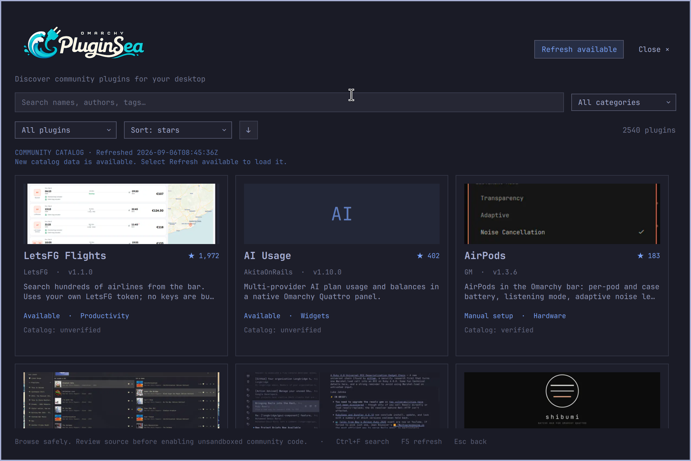
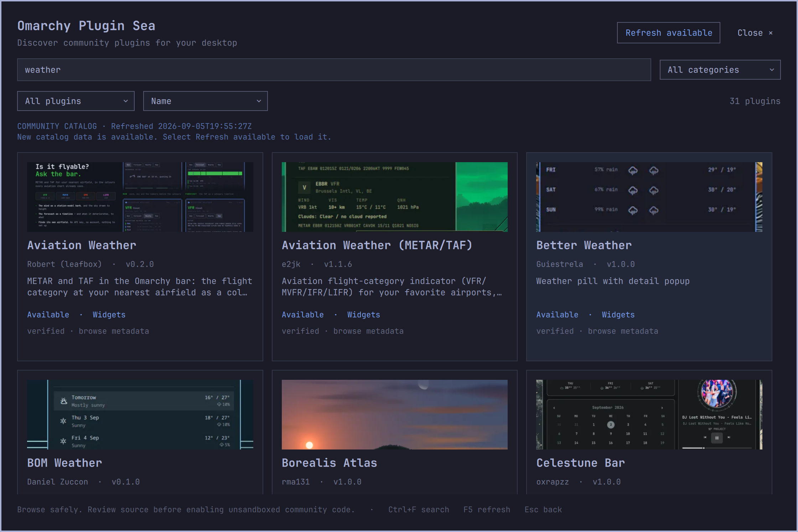

# Verification

The initial implementation results below are a historical baseline from 2026-09-05. Later dated sections record subsequent changes; current review results are recorded at the end.

Completed on the installed Omarchy desktop: one 2560×1600 display at scale 2 (1280×800 logical), Qt6 6.11.2, existing running Quickshell. No community plugin was installed to prove lifecycle behavior.

| Check | Result |
|---|---|
| `mise run setup` | Native dependencies and shell ping pass |
| `omarchy plugin validate .` | Pass |
| Bash syntax for every helper/script/test | Pass |
| `mise run check` | Pass: backend, actual Qt6 JS model, preview and isolated integration suites |
| Backend behavior/security | 43 assertions pass |
| Actual Qt6 CatalogModel tests | 13 assertions pass |
| Preview behavior/security | Decode, cached reuse, strict URL boundary, malformed data, resize, concurrent conversion pass |
| Isolated integration | Async registry discovery, repeated install/uninstall, byte-identical JSONC roundtrip, backups, unowned target and dangling-symlink rejection pass |
| Basic `qmllint` | Pass |
| Qt6 `qmllint` with host alias imports | Exit 0; 67 advisory warnings for Quickshell creatability/type metadata, dynamic theme objects and unqualified component access. Runtime was checked separately |
| `mise run smoke` | Actual summon/hide and inert local panel enable/disable/remove postconditions pass; fixture removed |
| `scripts/keyboard-smoke` | Search, arrows, Enter, details, Escape/back, empty search result and closing pass |
| Mouse input | Real Wayland pointer card activation, install-consent opening/cancellation, state/sort/category selection and menu Browse activation pass |
| Live catalog | 2,427 remote rows normalized; browser shows 2,429 rows including two local-only plugins |
| Real network failure | Dead localhost HTTPS proxy returns 2,427 last-known-good rows, `ok:true,stale:true`, preserved timestamp and curl error |
| Visual inspection | 1120×748, 760×620, and 620×480 logical surfaces; readable themed layout, working image previews/fallbacks, scrollable details/consent, reachable action buttons |
| Final shell logs | No browser QML warnings, exceptions or image decoder errors after fixes. One existing host portal app-ID registration warning is unrelated |
| Repository review | No credentials, caches, third-party implementation downloads, developer-only runtime paths, symlinks or shell evaluation in shipped runtime; required files tracked; whitespace checks pass |

## Visual evidence

The images below are actual captured browser surfaces, cropped at capture time so unrelated desktop content is excluded.



[Compact browser](screenshots/branded-compact.png) · [Full consent](screenshots/consent.png) · [Compact scrollable consent](screenshots/compact-consent.png)

Mouse input used a temporary Wayland virtual pointer client built against the installed Wayland libraries from the primary wlr protocol. It was used only for observed coordinates on this session's display and is not a product dependency.

## Exact retry commands

```bash
mise run check
mise run smoke
scripts/keyboard-smoke
omarchy-shell shell summon local.oma-plug-sea '{"width":620,"height":480}'
omarchy-shell shell call local.oma-plug-sea status '{}'
quickshell log -p "$OMARCHY_PATH/shell" -t 100 --no-color

# A real transport failure without changing network or desktop configuration:
HTTPS_PROXY=http://127.0.0.1:9 ALL_PROXY=http://127.0.0.1:9 \
  bin/oma-plug-sea-catalog refresh | jq '{ok,stale,error,fetchedAt,count:(.plugins|length)}'
# Recover using the normal endpoint:
bin/oma-plug-sea-catalog refresh | jq '{ok,stale,error,count:(.plugins|length)}'
```

WebP previews use an isolated native Qt helper. `qt6-imageformats` 6.11.2-1 was installed successfully through terminal authentication. `mise run setup` builds the helper and verifies codec support; `mise run check` passes with the installed Qt plugin. The expanded preview suite covers cached reuse, concurrency, strict URLs, malformed/truncated/foreign input, byte and dimension limits, transparency, first animation frame, metadata stripping, resizing and extreme thin images. A negative sentinel confirms the retired conversion command is never invoked.

Qt 6.11 rejects some valid WebPs shorter than its header probe. The helper pads only complete tiny RIFF containers outside their declared contents; truncated containers remain rejected. Regression fixtures cover both cases. A live marketplace preview decoded successfully into an isolated fresh cache. After a recoverable development reinstall, a fresh desktop preview cache populated through the new helper and visual checks passed at 1120×748 and 620×480. Logs showed no preview/QML errors; existing host portal/status-notifier warnings are unrelated.

[Browser with Qt-decoded previews](screenshots/qt-previews.png). Keyboard smoke checks also pass. Previously cached images were retained after verification for offline reuse.

The official signed registry endpoints remain unavailable (404), as recorded in platform research. Current catalog and Git management work; signed artifact installation cannot be supplied by this installed platform. Git update availability remains unknown until checked, and mutable HEAD can differ from reviewed metadata. These are explicit product limitations, not claimed verification guarantees.

## Naming update

The repository directory is now `omarchy_plugin_sea`; the manifest and interface display **Omarchy Plugin Sea**. Existing command, plugin ID and storage paths remain stable. The local installation and ownership marker were rebuilt from the new directory with recoverable configuration backups.

## Source polling update

The source-polling implementation passed 43 backend assertions at that stage, including 14 source polling cases: saved validators, unchanged HTTP 304, equal/changed ETags, Last-Modified, missing validators, old cache, unsupported HEAD fallback, malformed bodies and network/HTTP failures. Every check preserves the catalog cache byte-for-byte.

A real desktop test temporarily replaced only the saved ETag with a controlled old marker (with a timestamped backup), called `omarchy-shell shell call local.oma-plug-sea pollCatalog '{}'`, and verified **Refresh available** while the visible `weather` search stayed at 31 results. F5 fetched current data, cleared the indication and preserved the search. The actual current validators were restored through successful refresh. The unchanged live source reports `refreshNeeded:false`.



## Full-size viewer

Detail images now open a native image viewer by mouse click or Enter/Space. Live verification opened the 2048 listing's original 1600×836 image, confirmed the original dimensions through shell status, switched to 100% and 125% zoom, returned with Escape, reopened using restored keyboard focus, and closed through the mouse control without leaving the detail page. Fit layout was visually inspected at 1120×748 and 620×480. [Full-size viewer screenshot](screenshots/full-size-preview.png).

`mise run check` passes, including original-size cache separation/offline reuse and invalid-mode/dimension rejection. Qt6 static analysis exits 0 with 90 host/dynamic-type advisory warnings; the running shell logs contain no viewer/QML errors. The existing portal registration warning remains unrelated.

## Approved branding — 2026-09-06

The approved PluginSea wordmark is rendered in the browse header, with a shorter header on compact surfaces; detail pages show the matching icon. Plain-text accessibility names and an image-error text fallback preserve the application name. The development installer includes only the approved artwork pair, verified byte-for-byte by the isolated integration test.

`mise run check` passed. After the compact-height adjustment, QML static analysis and real keyboard smoke checks passed. Visual checks at 1120×748 and 620×480 confirmed readable branding, reachable controls and the detail-page icon. The shell was restarted to clear cached QML; its fresh logs contain no branding/image errors.

[Branded browser](screenshots/browser-transparent-logo.png) · [Compact browser](screenshots/branded-compact.png) · [Detail icon](screenshots/branded-detail.png)

## Source review and documentation audit — 2026-09-06

All three findings against initial commit dc778ef also applied to the current implementation. Updates now carry the consent snapshot's approved origin and reject changed, rewritten or ambiguous origins before any CLI update. Installed source links and provenance labels distinguish forks and missing origins from catalog metadata; matching repositories still do not authenticate the installed revision. Non-string optional statuses no longer invalidate a complete catalog and instead disable installation for that row. Available filtering now excludes manual-only listings.

`mise run check` passes: 57 backend behavior/security assertions, expanded actual Qt6 model/source-provenance assertions, preview tests and isolated integration checks. Qt6 static analysis exits successfully with 115 host/dynamic-type advisory warnings. The installed app was refreshed and visually checked; its source-review consent shows the fork origin and explicit catalog-verification mismatch.

A locally authored inert panel using the catalog ID terminal.2048 was discovered disabled with a different Git origin. Native update consent showed that installed origin. Changing the origin and refreshing local state left the consent text byte-identical; passing its old source to the real helper returned a changed-origin refusal before the CLI update. No remote fetch or code enable occurred. The fixture was moved to recoverable user state and its disappearance from plugin discovery was confirmed. [Consent evidence](screenshots/source-review-consent.png).

The Omarchy CLI has no atomic expected-origin parameter, so an external Git-config edit can still race the final precondition check and the CLI fetch. This limitation is documented rather than presented as full protection against concurrent same-user changes.

The README now uses the current branded screenshot and lists the Qt build/check packages, ripgrep and optional keyboard-test dependency. Obsolete conversion references were removed from current user documentation; historical screenshots and original verification results remain explicitly identified as earlier evidence. Action argument documentation, source identity rules, original-image size limits and symlink-discovery wording were also audited and corrected.

## Boundary and verification review — 2026-09-06

All six new findings were valid and addressed:

- Every remote preview now passes both a fixed-origin WebP allowlist and the separate restricted downloader/decoder. A real headless Quickshell test feeds normalized listings and legacy cached URLs into the production PreviewImage component, including PNG/JPEG, foreign WebP, traversal and extensionless URLs; only the approved image reaches the downloader and QML receives only a local PNG.
- Installation rejects Git insteadOf rewrites before add. Real Git regressions cover both local-file and different-GitHub-repository rewrites with no add/enable calls. Post-install manifest and raw/effective-origin checks refuse enabling an unexpected checkout.
- The production local-state coordinator discards pre-mutation success/error results and requires a fresh read. Qt tests deliberately reverse read/mutation completion order and exercise both orderings.
- Installed state no longer hides quarantined, yanked or unavailable catalog warnings. Model tests cover enabled/disabled state, extended status text and fork association. Details and consent render the warning independently; recovery actions remain available.
- Each installed build uses a SHA256-specific runtime path, including imported components. Desktop tests check installed bytes, checkout ownership and the live embedded fingerprint; isolated regressions reject stale files, stamps and live status.
- The headless model runner clears inherited platform themes. The exact reported environment, QT_QPA_PLATFORMTHEME=gtk3, now passes without a display connection.

mise run setup and mise run check pass: 61 backend assertions, expanded Qt model/coordinator assertions, the actual catalog-to-QML preview boundary, decoder tests and isolated installation tests. Qt6 static analysis succeeds with 130 advisory host/dynamic-type warnings. After installing the new build, mise run smoke passes real summon/hide and controlled inert enable/disable/remove transitions; scripts/keyboard-smoke passes search, arrows, details, Escape and empty-state checks. Both require the current runtime fingerprint. The fixture was removed successfully.

The running current build was visually inspected at 1120×748 and 620×480, with live catalog previews and 2,540 correlated listings. Shell logs show no new QML/runtime errors; the earlier host portal registration warning remains unrelated. The live catalog contained no quarantined/yanked listings, so lifecycle edge cases are covered by deterministic model fixtures rather than claimed as live-catalog observations.

Git source checks still cannot be atomic against unrelated same-user configuration edits during upstream CLI operations. Unsupported preview formats/origins intentionally display a fallback; this is now consistent across normalization, old caches and QML.

## Transparent branding — 2026-09-06

Version 4 removes the original navy matte through user-approved local Qt image processing, preserving the version 3 artwork. Both outputs are RGBA PNGs with more than one million fully transparent pixels each and partially transparent antialias/shadow edges. A thin navy contour and tight soft shadow preserve cream/cyan contrast on light backgrounds. Dark navy, white and pale blue composites were visually inspected; no simulated checkerboard asset is shipped.

`mise run check` passes, including installed asset equality and runtime fingerprint checks. The managed installation was refreshed, its live fingerprint verified, and the actual header inspected without the old rectangle. Keyboard smoke passes. The README screenshot and artwork references now use the transparent version. The reproducible preparation tool is development-only and adds no app dependency or runtime effect.

## Listing explanations and stars — 2026-09-06

Cards now show catalog repository star counts beside their titles; local-only entries display a dash. The existing descending-star sort is explicitly labelled “Stars: high to low.” Actual Qt model tests compare multiple candidates and cover malformed/negative/fractional counts. Availability, catalog verification and stars have themed, wrapped, plain-text hover explanations; tooltip content is positioned above the corresponding label.

`mise run check` passes (134 advisory QML warnings). After the final tooltip placement adjustment, QML/model checks and keyboard smoke pass. The installed runtime fingerprint was verified. Live mouse checks exercised both availability and catalog tooltips, selected star sorting, confirmed descending visible counts and opened a card. The listing was visually inspected at 1120×748 and 620×480; the README screenshot was refreshed.

## Separate sorting direction — 2026-09-06

The sort field dropdown now contains name, stars and date; a separate keyboard-focusable ↑/↓ button controls ascending/descending direction and retains it when the field changes. Its accessible name and hover explanation describe the current direction. Qt model tests cover both directions for all three fields. `mise run check` passes (136 advisory QML warnings); the installed runtime fingerprint and keyboard smoke pass. Live mouse checks toggle direction both ways, change fields without resetting direction, and confirm the resulting status. The compact 620×480 layout was visually checked; the README screenshot now shows the independent control.

## Standard Git installation and marketplace preview — 2026-09-06

Standard source installations now build the bundled Qt preview decoder automatically into a private XDG cache on first uncached preview. The cache signature covers source, builder and native toolchain; no build occurs in the checkout and no source/executable is downloaded. Dependencies are documented as packages to install before using Omarchy's normal add/enable command. The standard opening route is shell summon IPC; Omarchy has no manifest build/dependency hooks or automatic overlay menu contributions. The development launcher/menu workflow remains separate.

`mise run check` passes, including a new test through the actual installed Omarchy add/validate/catalog commands with an isolated HOME and local Git fixture. Only shell IPC and preview download are mocked; cloning, validation, native compilation and image decoding are real. The installed tree stays disabled and clean, with no generated binary or user-menu/config changes. A separate read-only source-tree test confirms one build for concurrent previews, cache reuse, source-change invalidation, missing-dependency guidance, failed-build atomic cleanup and successful retry without mise. QML analysis passes with 137 advisory warnings. The managed desktop installation was refreshed and keyboard smoke passes.

`preview.png` at the repository root is the current transparent-branding screenshot (2240×1496, under 1 MB), ready for marketplace image ingestion. README now references it and documents standard installation, opening, updating and removal. Plugin ID and publication status are unchanged.

## Publisher identity migration — 2026-09-06

Changed the application ID from `local.oma-plug-sea` to `webtechsponge.plugin-sea`, set author to `webTechSponge`, and declared the existing MIT license in the manifest. Updated IPC routes, installation paths, self-mutation protection, runtime verification and current documentation; the launcher, caches and inert smoke fixture retain their identifiers.

`mise run check` passed, including 61 backend assertions, Qt model and preview suites, real isolated Git installation, automatic decoder build/recovery, and managed integration ownership/fingerprint/cleanup checks. QML lint passed with 137 existing advisory warnings. The real local migration used the old checkout's `mise run uninstall` before changing the scripts, followed by `mise run install` and `mise run smoke`. The current runtime fingerprint was verified; summon/hide and inert fixture enable/disable/remove passed. Registry inspection confirmed only the new application ID is discovered and enabled. The new ID's self-removal request was correctly rejected. Recent shell logs contained no QML errors. Recovery copies remain in the existing XDG state directory.

## Security hardening (findings 2–5) — 2026-09-06

Implemented `docs/security-hardening-plan.md` via three parallel edit units plus one single-writer test integration. Finding 1 (origin-check TOCTOU vs. external Git config) remains an accepted documented platform limitation.

- Installed-source buttons are GitHub-canonical or disabled: new `safeGitHubLink` in `js/CatalogModel.js`, raw-URL fallback removed from `PluginDetails.qml`, both source buttons gated. `safeLink` unchanged for the marketplace preview gate. Model tests cover foreign-origin rejection and SSH canonicalization.
- `bin/oma-plug-sea-local` skips symlinked `manifest.json`/`.git` entries; they contribute no metadata row.
- `bin/oma-plug-sea-catalog` and `bin/oma-plug-sea-preview` refuse non-absolute, symlinked or unowned cache dirs (catalog falls back to last-good stale; preview returns `ok:false`). Refresh-time `etag`/`lastModified` are CRLF-stripped and bounded before persist.
- `tests/backend.sh` gains symlinked-manifest, symlinked-`.git`, symlinked-cache and CRLF-ETag cases; `tests/preview.sh` gains a symlinked-cache refusal case.

`mise run check` passes, including 69 backend assertions (was 61), Qt model and preview suites, and managed integration checks. QML analysis passes with 140 existing advisory warnings.
